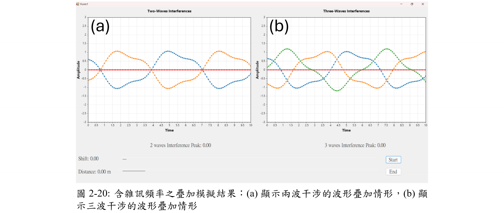
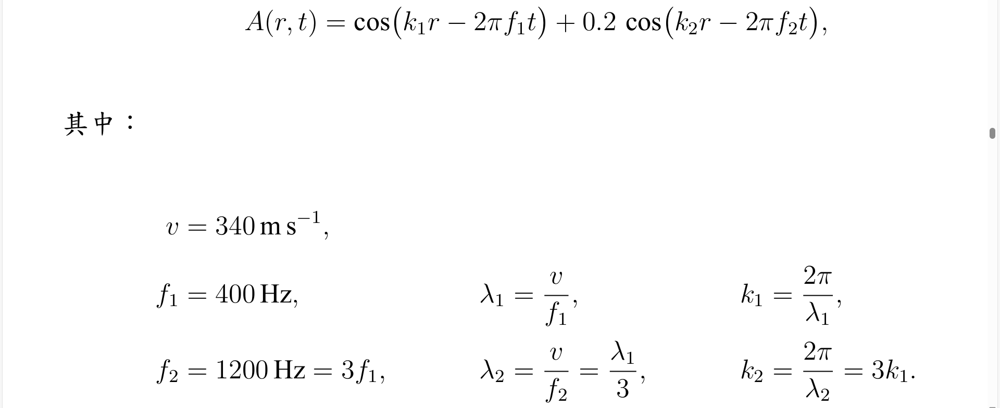

# C# Simulation – Mix-Frequency Interference | 混頻干涉模擬

This project is a follow-up extension to the [C# simulation on interference peak](https://github.com/iceappletea/C-simulation-peak), designed to explore how **additional high-frequency components (e.g., noise)** affect the overall interference pattern when mixed with a base signal.

The simulation is implemented in C# (Windows Forms) and provides an interactive interface for visualizing the superposition of waves with **mixed frequencies**, demonstrating how noise affects peak structure and waveform stability.

本專案為 [C# 干涉峰值模擬](https://github.com/iceappletea/C-simulation-peak) 的延伸版本，旨在探討當基本訊號中夾雜高頻成分（如雜訊）時，干涉圖形與波形穩定性會產生何種變化。  
程式以 C# 撰寫，使用 Windows Forms 呈現混頻後的干涉效果，提供可視化操作介面以觀察混頻波疊加之行為。

---

## 🔧 Features | 功能特色

- Simulates interference of **multiple sources** each containing both a **primary frequency** and an **additional high-frequency component** (e.g., noise).
- Base frequency is set to **400 Hz**, while the **additional frequency component is 1200 Hz**, uniformly present in all sources.
- Visualizes waveform distortion and amplitude envelope changes under frequency mixing.
- Offers theoretical support for mixed-frequency interference via reference plots.

---

## 📷 Screenshot | 執行畫面截圖

---

## 📚 Theory | 理論說明圖

The theoretical figure below illustrates the case of **400 Hz as the base frequency** and **1200 Hz as the added frequency component**, showing how the combined waveform is affected. This applies uniformly to all wave sources.

以下理論圖展示了當主頻為 400 Hz 且夾雜 1200 Hz 雜訊時的疊加波形，所有波源均含有此混頻成分：

---

## 🔄 Relation to Previous Project | 與前一模擬的關聯

This simulation is an extended version of the previous project C-simulation-peak, which investigated the effects of source phase and position variations under a fixed frequency. In contrast, the current simulation introduces the addition of high-frequency noise (e.g., 1200 Hz) to observe its influence on interference results and wave superposition behavior.

本模擬為前案的延伸版本。前案探討在固定頻率下改變波源「相位」與「位置」之影響，而本案則新增**夾雜高頻雜訊（如 1200 Hz）**的情況，以觀察對干涉結果與疊加行為的影響。
